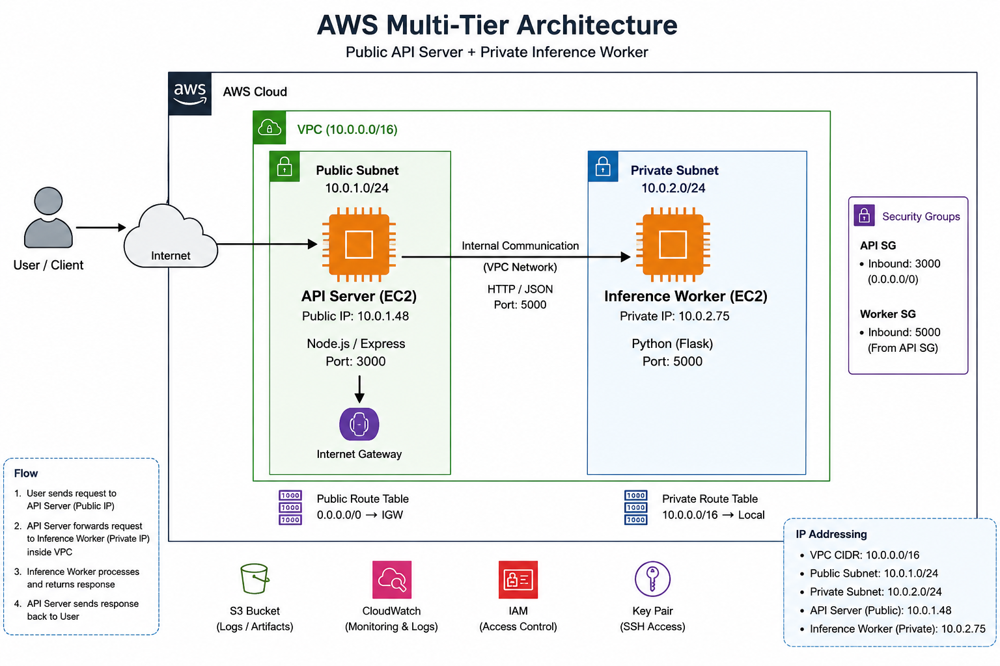

# DevOps Internship Assignment Submission

## Architecture Diagram



---

## Project Overview

This project implements a secure multi-tier AWS infrastructure using Terraform, following DevOps and cloud networking best practices.

The system consists of:

- Public API Server (EC2)
- Private Inference Worker (EC2)
- VPC networking
- Public and Private Subnets
- Internal service communication
- Infrastructure provisioning using Terraform

The API server is publicly accessible while worker nodes remain isolated within private networking.

---

## Architecture

```
Internet User
      │
      ▼
+----------------------+
| Public API Server    |
| EC2 (Public Subnet)  |
| Node.js + Express    |
| Port 3000            |
+----------------------+
      │
      │ Internal VPC Communication
      ▼
+----------------------+
| Inference Worker     |
| EC2 (Private Subnet) |
| Python Service       |
| Port 5000            |
+----------------------+
```

### Network Design

| Component | Configuration |
|------------|---------------|
| VPC CIDR | 10.0.0.0/16 |
| Public Subnet | 10.0.1.0/24 |
| Private Subnet | 10.0.2.0/24 |
| API Server | Public EC2 |
| Worker Server | Private EC2 |
| API Port | 3000 |
| Worker Port | 5000 |

---

## Infrastructure Provisioned

Terraform provisions:

- VPC
- Public Subnet
- Private Subnet
- Internet Gateway
- Route Tables
- Security Groups
- EC2 Instances
- Internal VPC Networking

Infrastructure validation:

```bash
terraform fmt
terraform validate
```

Validation Output:

```text
Success! The configuration is valid.
```

---

## Project Structure

```
devops-internship-assignment/
│
├── api/
│   └── server.js
│
├── inference/
│   └── app.py
│
├── terraform/
│   └── main.tf
│
├── scripts/
│   ├── deploy-api.sh
│   └── deploy-inference.sh
│
├── systemd/
│   ├── api.service
│   └── inference.service
│
├── docs/
│   └── architecture.png
│
├── README.md
└── .gitignore
```

---

## API Endpoint

Public endpoint:

```http
POST /v1/chat/completions
```

Example request:

```bash
curl -X POST http://PUBLIC_IP:3000/v1/chat/completions \
-H "Content-Type: application/json" \
-d '{"message":"Hello DevOps"}'
```

Example response:

```json
{
  "response":"Processed: {\"message\":\"Hello DevOps\"}"
}
```

---

## Deployment

### Terraform

```bash
cd terraform

terraform init

terraform validate

terraform apply
```

---

### API Server

```bash
cd api

npm install

node server.js
```

---

### Inference Worker

```bash
cd inference

python3 app.py
```

---

## Service Management

Systemd service files are included.

Enable services:

```bash
sudo cp systemd/api.service /etc/systemd/system/

sudo cp systemd/inference.service /etc/systemd/system/

sudo systemctl daemon-reload

sudo systemctl enable api

sudo systemctl enable inference

sudo systemctl start api

sudo systemctl start inference
```

Check status:

```bash
sudo systemctl status api

sudo systemctl status inference
```

---

## Validation Performed

### Internal API Validation

```bash
curl -X POST http://localhost:3000/v1/chat/completions \
-H "Content-Type: application/json" \
-d '{"message":"Internal test"}'
```

Passed ✅

---

### External API Validation

Public endpoint tested externally.

Passed ✅

---

### Network Isolation Validation

Private worker node verified inaccessible from public internet.

Passed ✅

---

### Failure Recovery Validation

Worker shutdown tested.

API correctly returns connection failure.

Worker restart restores functionality.

Passed ✅

---

## Security Design

Security controls implemented:

- Private subnet worker isolation
- No public exposure for inference worker
- Internal VPC-only communication
- Security Group restrictions
- Bastion/API host access pattern
- Infrastructure as Code provisioning

---

## Future Improvements

Potential production enhancements:

- HTTPS / TLS
- NAT Gateway
- Auto Scaling Groups
- CloudWatch monitoring
- Health checks
- IAM least privilege model
- Containerization (Docker)
- Kubernetes deployment
- Distributed inference scaling
- CI/CD pipeline integration

---

## Technologies Used

- AWS EC2
- AWS VPC
- Terraform
- Node.js
- Express.js
- Python
- Linux
- Systemd

---

## Assignment Outcome

Implemented a secure multi-tier AWS deployment architecture demonstrating:

- Infrastructure provisioning
- Cloud networking
- Secure service isolation
- Internal service communication
- Deployment automation
- Infrastructure reproducibility

---

Author: Mohammed Faiz

GitHub:

https://github.com/Mfaiz01/devops-internship-assignment
